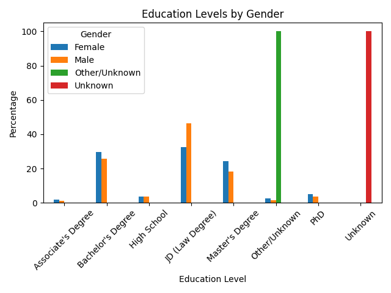
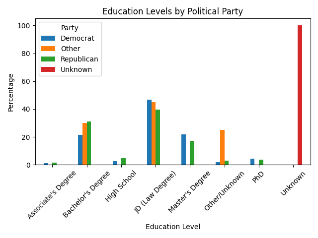
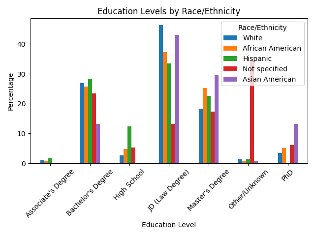
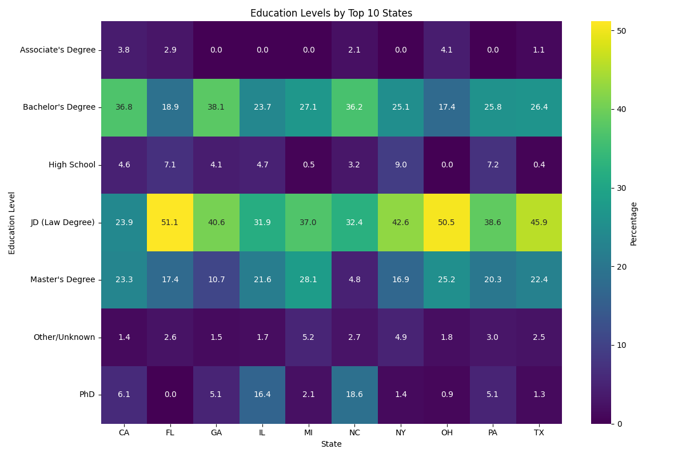

# Voter Network Analysis

**Research conducted during Spring 2025 at Columbia University's Social Networks and Political Accountability Lab.**  
*Under the guidance of Victoria Mooers.*

---

## Overview

This project investigates **education trends among members of the U.S. Congress** and their connections to **sociopolitical networks**, with a focus on **demographic representation** and **partisan dynamics**.

Through the analysis of congressional education data, we explore how factors such as **gender**, **race/ethnicity**, **party affiliation**, **geography**, and **gerrymandering** intersect with the makeup of representative bodies. The findings aim to inform ongoing discussions on **equity**, **political accountability**, and the structure of American democracy.

---

## Project Structure

| File / Folder | Description |
|---------------|-------------|
| `StatesAndCyclesData_production-20240301a.csv` | Base dataset of congressional terms and states |
| `merge_education.py` | Merges education data from multiple sources |
| `education_analysis.py` | Core analysis of education trends |
| `gerrymandering_flags.py` | Flags gerrymandered districts |
| `merged_congress_education.csv` | Merged dataset for analysis |
| `processed_education_data.csv` | Final dataset for visualizations |
| `.png files` | Visual summaries of trends (gender, race, party, state) |

---

## Sample Visualizations

- **Education by Gender**  
  

- **Education by Political Party**  
  

- **Education by Race/Ethnicity**  
  

- **Education by State**  
  

---

## License

- Code (`.py` files) → Licensed under the [MIT License](LICENSE)
- Data and visualizations → Licensed under [Creative Commons Attribution-NonCommercial 4.0 International (CC BY-NC 4.0)](LICENSE-data.md)

You are welcome to reuse, adapt, and share this work with attribution for **non-commercial** purposes. For commercial applications, please contact the author.

